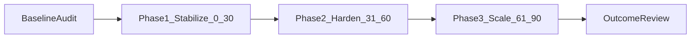

# Benchmark + Gelistirme Yol Haritasi

## 1) Amac ve Kapsam

Bu rapor, `kktcmarketin24` projesinin mesajlasma ve siparis yasam dongusu olgunlugunu:

- mevcut kodtabani gercekligi (as-is) ile
- benzer platformlarin yayinli pratikleriyle

kiyaslayarak, 90 gunluk uygulanabilir bir gelistirme yol haritasi sunar.

Kapsam odagi:

- Guvenlik modeli (RLS, rol izolasyonu, API guard)
- Mesajlasma operasyonu (thread, yetki, realtime, SLA)
- Siparis yasam dongusu (durum gecisleri, iptal/iade, idempotency)
- Operasyonel kalite (test, CI, dokumantasyon)
- Olcekleme (pagination, metrik, gozlenebilirlik)

## 2) As-Is Teknik Baseline

### 2.1 Mimari Ozet

- Mesajlasma tablolari: `support_threads` + `support_thread_messages`
- Akislar:
  - Customer <-> Vendor: `/api/messages/customer-vendor/[vendorOrderId]`
  - Vendor <-> Admin: `/api/messages/vendor-admin` ve `/api/messages/vendor-admin/[threadId]/messages`
- UI:
  - Ortak panel: `components/shared/thread-chat-panel.tsx`
  - Vendor/Admin inbox: `components/messaging/vendor-admin-inbox.tsx`
  - Customer/Vendor siparis ekranlarinda thread panel entegrasyonu var
- Realtime:
  - `support_thread_messages` INSERT event'leri dinleniyor
  - Inbox listesi `support_threads` degisikliklerinde yeniden yukleniyor

### 2.2 Olgunluk Skoru (Mevcut)

- Mesajlasma + siparis operasyon olgunluk skoru: **5.5 / 10**

Skor gerekcesi:

- Guclu: endpoint ayrimi, rol bazli app-level guard, migration disiplini, QA checklist var
- Zayif: RLS permissive, otomasyon seviyesi dusuk, dokuman/implementasyon drift, olcekleme eksikleri

## 3) Benzer Platform Benchmark Ozeti

Bu bolumde kamuya acik dokumanlar baz alinmistir:

- Trendyol Akademi (satici destek islemleri)
- Hepsiburada Developer API (iptal/iade/talep)
- Etsy Help/Policy (mesajlasma SLA ve policy)

### 3.1 Kiyas Matrisi (5 Eksen)

| Eksen | Bu Proje (As-Is) | Trendyol | Hepsiburada | Etsy | Gap Ozet |
|---|---|---|---|---|---|
| Guvenlik modeli | API tarafinda guclu guard, DB RLS secici degil (authenticated select genis) | Platform merkezli erisim yonetimi | API contract ve entegrasyon kurallari net | Platform policy + case sistemi guclu | DB-level satir izolasyonu sertlestirilmeli |
| Mesajlasma operasyonu | Thread var, realtime var, resmi SLA yok | Satici destek/is talep akislari tanimli | Talep/iptal/iade API akislari tanimli | Mesaj cevap hizi KPI (48 saat / %80) | SLA ve operasyon metrikleri eksik |
| Siparis yasam dongusu | Durum gecisleri ve iade akisi mevcut | Panel odakli operasyon | Idempotency ve detayli API semantigi belirgin | Siparis sorununu case akisina tasiyor | Mesajlasma ile siparis durumu kurallari daha net baglanmali |
| Operasyonel kalite | Manual checklist + hafif smoke script | Kurumsal operasyon pratikleri | Gelismis API dokumani | Net policy ve servis standartlari | Otomatik test/CI ve runbook eksik |
| Olcekleme | Realtime var, fakat listeleme/pagination sinirli | Yuksek operasyon olgunlugu | Entegrasyon olgunlugu yuksek | Inbox yönetimi ve sinyal metrikleri guclu | Pagination + observability + performans KPI gerekli |

### 3.2 Dis Kaynaklardan Alinacak Pratikler

- SLA tanimi:
  - Ilk yanit suresi, cozum suresi, thread kapanis suresi KPI'lari
- Policy seviyesi:
  - Mesajlasma davranis kurallari + role-boundary ihlal politikasi
- API disiplini:
  - Idempotent yazma endpointleri
  - Yan etki ureten GET davranislarini azaltma
- Operasyon:
  - Haftalik kalite kapisi (lint + typecheck + smoke + kritik senaryo)

### 3.3 Kiyas Kanit Tipi Normalizasyonu

| Platform | Evidence Type | Not |
|---|---|---|
| Trendyol | Policy + Operasyonel Surec | Satici destek akislarinin isleyis odakli oldugu goruluyor |
| Hepsiburada | API Contract + Entegrasyon Kurali | Iptal/iade/talep semantiklerinde teknik sozlesme belirgin |
| Etsy | Policy + SLA + Inbox Operasyonu | Mesajlasma cevap hizi ve yardim talebi SLA net tanimli |

Bu etiketleme, farkli kaynak tiplerinden gelen benchmark verisini tek bir cercevede karsilastirmak icin kullanilir.

## 4) Kritik Bosluklar (P0/P1/P2)

### P0

1. `support_threads` ve `support_thread_messages` icin DB-level RLS seciciligi yetersiz (`USING (true)` select policy).
2. Guvenlik modeli API'ye asiri bagimli; DB tarafinda defense-in-depth zayif.

### P1

1. Mesajlasma endpointlerinde GET tarafinda thread olusumu gibi yan-etkili davranislar bulunuyor.
2. Vendor-admin akisinda multi-store senaryolari yanlis store baglama riski tasiyor.
3. Realtime abonelikleri daha dar kapsamli filter ile optimize edilmemis.
4. Mesajlasma kurallari ile siparis status kurallari arasinda net policy bagi eksik.

### P2

1. Mesaj listelerinde cursor pagination yok; yuksek hacimde performans riski.
2. Dokuman/implementasyon drift'i var (tasarim dokumani farkli model tarif ediyor).
3. Destek deneyimi bazi ekranlarda legacy davranis kalintisi tasiyor.

## 5) 90 Gunluk Gelistirme Yol Haritasi

### 5.1 Faz Yonetisim Modeli

Her faz icin asagidaki yonetisim sarti zorunludur:

- 1 adet DRI (tek hesap veren sahip)
- Haftalik KPI raporu
- Faz-gate checklist tamamlama kaydi
- Deploy onayi oncesi risk/rollback notu

### Faz 1 (Gun 0-30) - Stabilize

Hedef: P0/P1 guvenlik ve tutarlilik risklerini kapatmak.

Teslimatlar:

1. RLS policy rewrite:
   - customer / vendor-owner / admin ayrimi ile satir bazli erisim
2. API semantik duzeltme:
   - GET side-effect azaltma, idempotent create davranisi
3. Multi-store thread-store dogrulama:
   - thread olusumunda dogru store baglama
4. QA matrix genisletme:
   - mesajlasma role-boundary negatif senaryolari

Sorumlu alanlar:

- Backend/API
- DB migration
- QA

DRI:

- Security/Backend Lead (asli sahip)
- QA Lead (dogrulama sahipligi)

KPI:

- Yetkisiz mesaj/veri erisimi testlerinde **%100 bloklama**
- Mesaj endpoint P0 bug sayisi: **0**
- P1 guvenlik regresyonu: **0**

Exit kriteri:

- RLS + API kontrolu birbirini dogrulayan test seti ile green

Phase Gate Checklist:

- [ ] RLS policy degisiklikleri migration ile versiyonlandi
- [ ] Yetkisiz erisim negatif testleri green
- [ ] Multi-store thread-store dogrulama senaryosu green
- [ ] Deployment icin rollback adimi yazili

### Faz 2 (Gun 31-60) - Harden

Hedef: Operasyonel dayanimi ve suistimal direncini arttirmak.

Teslimatlar:

1. Realtime optimizasyonu:
   - scope daraltma, gereksiz full refetch azaltimi
2. Rate limit / abuse guard:
   - message POST endpointleri icin
3. Mesajlasma policy seti:
   - acik davranis kurallari, eskalasyon adimlari
4. Dokuman parity:
   - teknik tasarim dokumani ile implementasyon hizalama

Sorumlu alanlar:

- Backend
- Frontend
- Product/Support Ops

DRI:

- Messaging Platform Lead (asli sahip)
- Support Operations Lead (SLA sahipligi)

KPI:

- Mesaj endpoint 5xx orani: **< %1**
- Realtime kaynakli gereksiz liste refetch oraninda **en az %40 iyilesme**
- Ilk yanit SLA raporlama kapsami: **%100 thread**

Exit kriteri:

- Kritik operasyon metrikleri dashboarddan izlenebilir

Phase Gate Checklist:

- [ ] Realtime scope daraltmasi prod-benzeri ortamda dogrulandi
- [ ] Rate-limit korumalari etkin ve test edildi
- [ ] Mesajlasma policy dokumani yayinlandi
- [ ] Faz KPI raporu haftalik ritimde uretiliyor

### Faz 3 (Gun 61-90) - Scale

Hedef: Buyuyebilir mesajlasma ve release kalitesini kalicilastirmak.

Teslimatlar:

1. Cursor pagination + load older:
   - message history performansini sabitleme
2. Observability:
   - p95 gecikme, hata oranlari, worker saglik metrikleri
3. Release quality gate:
   - lint + typecheck + smoke + kritik API regresyon pipeline
4. Operasyon runbook:
   - incident triage ve rollback proseduru

Sorumlu alanlar:

- Platform/Infra
- Backend
- QA

DRI:

- Platform Engineering Lead (asli sahip)
- QA Automation Lead (kalite kapisi sahipligi)

KPI:

- Message listing p95: hedef ortama gore olculup **en az %30 iyilesme**
- Prod'a kacan P1 regresyonlarda **en az %50 azalis**
- Kalite kapisindan gecmeden release: **0**

Exit kriteri:

- 4 hafta boyunca kalite KPI'lari hedef aralikta

Phase Gate Checklist:

- [ ] Cursor pagination yuk altinda test edildi
- [ ] p95 ve hata metrikleri dashboardda kalici takipte
- [ ] CI quality gate release oncesi zorunlu
- [ ] Incident triage + rollback runbook onaylandi

## 6) Uygulama Backlog'u (Oncelik Sirali)

1. RLS sertlestirme migration seti
2. RLS negatif/pozitif test senaryolari
3. Customer-vendor GET/POST davranis netlestirme
4. Vendor-admin multi-store store-binding duzeltmesi
5. Realtime subscription filtrelerinin daraltilmasi
6. Mesaj endpoint rate limit
7. Cursor pagination
8. QA checklist + smoke kapsam genisletme
9. Dokuman parity ve runbook
10. Release quality gate standardizasyonu

### 6.1 Backlog Bagimliliklari

| Is Maddesi | Depends On | Sebep |
|---|---|---|
| 2. RLS negatif/pozitif test senaryolari | 1 | Policy olmadan dogru test beklentisi olusmaz |
| 3. Customer-vendor GET/POST davranis netlestirme | 1 | Guvenlik semantigi ile API davranisi birlikte netlesmeli |
| 5. Realtime subscription filtrelerinin daraltilmasi | 1, 4 | Yetki modeli ve dogru store baglantisi gerektirir |
| 7. Cursor pagination | 3 | Endpoint sozlesmesi sabitlendikten sonra guvenli ilerler |
| 8. QA checklist + smoke kapsam genisletme | 1, 3, 4, 5 | Yeni davranislarin tumu checklist'e yansitilmali |
| 10. Release quality gate standardizasyonu | 8, 9 | Teknik + operasyonel ciktilar tamamlanmadan gate eksik kalir |

## 7) Kabul Kriterleri ve Olcum Metodu

### 7.1 KPI Takip Tablosu (Execution-Ready)

| KPI | Baseline (T0) | Hedef | Olcum Kaynagi | Raporlama Frekansi | Owner |
|---|---|---|---|---|---|
| Yetkisiz erisim bloklama orani | Faz-1 baslangicinda olculecek | %100 | API/DB negatif test sonuclari | Haftalik | Security/Backend Lead |
| Mesaj endpoint 5xx orani | Faz-2 baslangicinda olculecek | < %1 | API metrics (status code dagilimi) | Haftalik | Messaging Platform Lead |
| Realtime gereksiz refetch orani | Faz-2 baslangicinda olculecek | en az %40 iyilesme | Frontend telemetry / event sayaci | Haftalik | Frontend Lead |
| Message listing p95 | Faz-3 baslangicinda olculecek | en az %30 iyilesme | APM/API latency dashboard | Haftalik | Platform Engineering Lead |
| P1 regresyon escape rate | Son 30 gun incident verisi | en az %50 azalis | Bug tracker + release notlari | Aylik | QA Automation Lead |

### Kabul Kriterleri

- Guvenlik:
  - Yetkisiz roller thread/message okuyamaz
  - Role-boundary bypass senaryolari red olur
- Tutarlilik:
  - Thread olusumu deterministic ve idempotent calisir
  - Multi-store vendor dogru store/thread eslemesiyle calisir
- Performans:
  - Pagination ile yuksek hacimde response sureleri kontrol altinda kalir
- Operasyon:
  - Kritik metrikler dashboarddan izlenir
  - Release quality gate standart hale gelir

### Olcum Metodu

- Teknik metrikler:
  - API 4xx/5xx dagilimi
  - p95 endpoint latency
  - Realtime refresh/refetch sayisi
- Isletim metrikleri:
  - Ilk yanit suresi
  - Thread cozum suresi
  - Escalation oranlari
- Kalite metrikleri:
  - CI pass rate
  - Regression defect escape rate

## 8) Referanslar

- Trendyol Akademi - Satici Destek: https://akademi.trendyol.com/TrainingContent?TrainingId=2631
- Hepsiburada Developer API (iptal, talep, iade): https://developers.hepsiburada.com/hepsiburada/reference
- Etsy Help - Seller Messaging: https://help.etsy.com/hc/en-us/articles/115015654988-How-to-Send-Messages-to-Buyers
- Etsy Help - Customer Service Standards: https://help.etsy.com/hc/en-us/articles/360036207794-What-are-Etsy-s-Customer-Service-Standards
